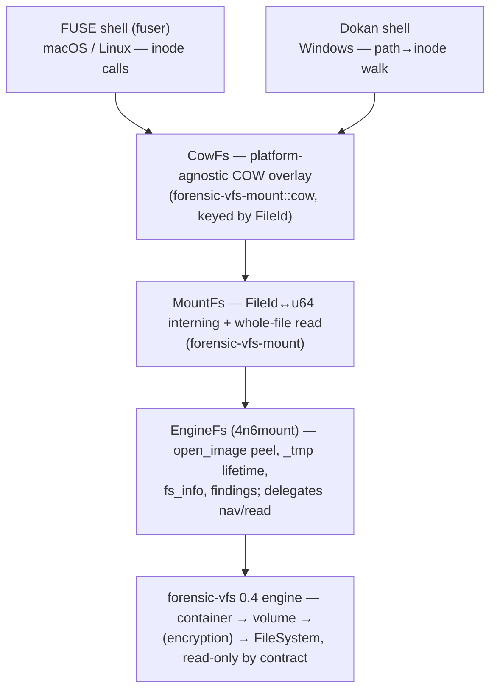

# 4n6mount — Product Requirements (mount architecture v2)

*A forward-written redesign of the mount model. Every current-state claim below is
grounded in a same-session read of `src/` (2026-07-19); the load-bearing decisions live
as ADRs [0004](decisions/0004-single-root-cow-default.md)–[0008](decisions/0008-deleted-in-place-orphans.md)
under [`docs/decisions/`](decisions/) (0001–0003 cover AD1, AFF4, and memory-dump
mounting and stand unchanged). Companion to the fleet's
[forensic-vfs PRD](../../forensic-vfs/docs/PRD.md), whose read-only contracts this
design builds on — and never weakens.*

## Executive Summary

4n6mount v2 presents **one tree — `root/` — writable by default through a
copy-on-write overlay**. The evidence image is never modified: the underlying
forensic-vfs contracts have no write method at all (forensic-vfs ADR 0001), so every
write lands in a scratch overlay and evidence immutability holds by construction, not
by discipline. `--read-only` turns the same tree into a genuinely read-only mount
(writes rejected) with no overlay.

Five changes carry the redesign:

1. **Single `root/`, COW by default** — the confusing dual `ro/`+`rw/` twin trees are
   gone; `--read-only` is the opt-out ([ADR 0004](decisions/0004-single-root-cow-default.md)).
2. **Universal COW** — the overlay moves out of the Unix-only FUSE handler into a
   platform-agnostic layer keyed by the contract's stable `FileId`, shared by the FUSE
   (macOS/Linux) and Dokan (Windows) shells; Windows gains write parity
   ([ADR 0005](decisions/0005-universal-cow-overlay.md)).
3. **Adopt `forensic-vfs-mount`** — the hand-rolled `EngineFs` inode allocator and
   read loop are replaced by the shared `MountFs` adapter on forensic-vfs 0.4; the COW
   layer becomes a new module of that crate so the whole fleet inherits it
   ([ADR 0006](decisions/0006-adopt-forensic-vfs-mount.md)).
4. **Lazy derived artifacts** — `journal/` and `metadata/timeline.jsonl` are expensive
   decodes; they materialize on first read, spill to the session scratch, and fail
   loud ([ADR 0007](decisions/0007-lazy-derived-artifacts.md)).
5. **Deleted files in their real forensic location** — recovered-deleted entries
   render **in-place in `root/`** (real path, real name, marked out-of-band via
   xattr) or under **`$Orphans/`** when unplaceable — never today's flat hollow
   `deleted/`, which silently renders errors as a clean image. `unallocated/` is
   removed until carving is real
   ([ADR 0008](decisions/0008-deleted-in-place-orphans.md)).

**Current vs target, honestly:** everything in this document except the shipped
behavior called out as "today" is *design, not code*. Nothing here is implemented yet.

## 1. Problem (what the shipped mount gets wrong)

The shipped mount (v0.x, `MountLayout::DiskOverlay`) presents seven virtual
directories — `ro/ rw/ deleted/ journal/ metadata/ unallocated/ session/`
(`src/fusefs.rs::VIRTUAL_DIRS`) — and gets five things wrong:

1. **The dual tree confuses.** The same file exists at two paths (`ro/etc/passwd`
   and `rw/etc/passwd`); the analyst must know which twin to point a tool at, and
   `rw/` is writable only when `--session` was passed — otherwise both trees are
   read-only and the distinction is noise.
2. **Four of the seven directories are hollow, and they lie about it.**
   `deleted/` swallows enumeration errors into an empty listing
   (`fs.deleted_inodes().unwrap_or_default()`, `src/fusefs.rs:175`) and renders every
   entry as a 0-byte "recovered" file because the content-read path does not exist;
   `journal/` maps any error to an empty list (`Err(_) => Vec::new()`,
   `src/fusefs.rs:208`); `metadata/timeline.jsonl` degrades to empty and
   `superblock.json` to `{}` on error; `unallocated/` lists ranges whose bytes cannot
   be read through the inode-addressed trait. An error and a clean image are
   indistinguishable — the canonical fail-loud violation.
3. **COW is Unix-only.** The overlay lives inside `#[cfg(unix)]` `fusefs.rs` +
   `session.rs`; the Windows backend mounts Dokan with `MountFlags::WRITE_PROTECT`
   and ignores its `session` parameter entirely (`src/fuse_windows.rs`).
4. **The overlay key is unstable across mounts.** Modified files are keyed by the
   backend's `u64` inode, persisted as overlay id `ino_{fs_ino}` — but `EngineFs`
   assigns those `u64`s from a dense first-seen interning allocator, so the number a
   file gets depends on browse order. A resumed session can attach an overlay blob to
   the *wrong file*. This is a latent correctness bug, not just an architecture smell.
5. **EngineFs duplicates the fleet and pins stale.** `EngineFs` re-implements the
   `FileId↔u64` interning table and whole-file read loop that the published
   `forensic-vfs-mount::MountFs` already provides, and 4n6mount pins
   `forensic-vfs = "0.3"` + a path-dep engine `0.1` while the contract crate is at
   0.4.2 (and `forensic-vfs-mount` itself still pins forensic-vfs `0.1`).

## 2. Goals

- **One tree, zero-config writable.** `4n6mount image.E01 /mnt` gives a browsable,
  writable `root/` immediately — no flag, no session directory required — while the
  evidence image stays byte-identical, provably.
- **Identical semantics on macOS, Linux, and Windows.** One COW implementation, two
  thin platform shells.
- **The mount never lies.** Every directory shown is real; every error surfaces as an
  error; capability gaps are stated (`metadata/capabilities.json`), never rendered as
  an empty result.
- **Instant mount.** Nothing expensive (journal decode, timeline build) runs at mount
  time; derived artifacts are computed on first read and cached.
- **DRY on the fleet.** Mount plumbing lives once, in `forensic-vfs-mount`, on
  forensic-vfs 0.4.

## 3. Non-goals

- **Writing to the evidence image.** Never, in any mode. Not a configuration.
- **Block-level COW.** v2 keeps whole-file copy-up (today's model). Sub-file COW for
  multi-GB files is future work (ADR 0005 residuals).
- **A flat `deleted/` directory.** Recovered-deleted entries render in-place or in
  `$Orphans/` (ADR 0008) — and only once the readers deliver real recovered entries;
  until then no deleted rendering at all. `unallocated/` (raw carve-only free space)
  stays removed until real carving lands; carving remains the job of the dedicated
  tools (issen, disk4n6) meanwhile.
- **Visible deleted-markers in names or permissions.** The working-filesystem goal
  forbids decorating recovered names or forcing them read-only; status is xattr-only
  (ADR 0008).
- **A WinFsp migration.** Evaluated and rejected in ADR 0005; Dokan stays.
- **Writable memory mounts.** Memory-dump mounts (`MountLayout::Raw`, ADR 0003) stay
  read-only; a COW overlay over a synthesized process/module tree has no use case.

## 4. The mount a user sees

```
/mnt/evidence/
├── root/            the filesystem — ONE tree, writable (COW) by default;
│   ├── etc/…        recovered-deleted files appear IN-PLACE at their real paths,
│   └── Users/…      real names, xattr-marked (user.4n6.status), COW-writable
├── $Orphans/        recovered entries with no placeable path: true orphans +
│                    name-collision deletes — notes.txt@2024-01-05T12-30-00Z~mft12345
│                    (name @ filename-safe UTC mtime ~ stable record id)
├── journal/         lazy: decoded FS journal transactions (when the reader supports it)
├── metadata/
│   ├── superblock.json      fs_info: fs kind, sector sizes, timestamp policy
│   ├── capabilities.json    which surfaces this reader supports, and why others are absent
│   └── timeline.jsonl       lazy: MACB (+ journal) super-timeline of the EVIDENCE
└── session/         overlay provenance: status.json, manifest of modified/created/deleted
```

`evidence/` (the `--filter-db` known-good-filtered view) is unchanged by this design
and appears only when filter databases are supplied. `$Orphans/` and the in-place
deleted entries appear only when the reader produces real recovered entries
(ADR 0008). The flat `deleted/` and `unallocated/` are gone (ADR 0008); `ro/` and
`rw/` are gone (ADR 0004).

### Modes

| Invocation | Overlay | Writes to the view | Evidence image |
|---|---|---|---|
| `4n6mount img /mnt` | ephemeral scratch (temp dir, discarded at unmount) | allowed (COW) | untouched |
| `4n6mount img /mnt --session DIR` | persistent in `DIR`, resumable (`--resume`), SHA-256-bound to the image | allowed (COW) | untouched |
| `4n6mount img /mnt --read-only` | none | rejected (`EROFS` / `WRITE_PROTECT`) | untouched |

`--read-only` conflicts with `--session`/`--resume` (clap `conflicts_with`); memory
mounts imply it.

## 5. Architecture



Both shells are Humble Objects: every decision (overlay resolution, copy-up, inode
interning, path mapping) lives below them in testable, platform-neutral code.

## 6. Current vs target

| Aspect | Today (shipped) | Target (this design) |
|---|---|---|
| Tree | `ro/ rw/ deleted/ journal/ metadata/ unallocated/ session/` | `root/ journal/ metadata/ session/` |
| Default writability | read-only unless `--session` | COW-writable; `--read-only` opts out |
| Windows | Dokan `WRITE_PROTECT`, session ignored, raw tree only | full parity: same tree, same COW |
| COW home | `#[cfg(unix)]` `fusefs.rs` + `session.rs` | `forensic-vfs-mount::cow`, platform-agnostic |
| Overlay key | backend `u64` ino (browse-order-dependent) as `ino_{n}` | serialized `FileId` + path annotation |
| Inode space | arithmetic offset namespaces (`+1000`/`+10M`/…), created files ≥ 9M hack | one interning allocator + small reserved virtual inos |
| Deleted files | flat `deleted/`, hollow; errors render as empty/0-byte | in-place in `root/` (xattr-marked, COW-writable) or `$Orphans/`; capability-gated, fail-loud (ADR 0008) |
| `unallocated/` | listable ranges whose bytes cannot be read | removed until real carving; gated reintroduction (ADR 0008) |
| `journal/`, `timeline.jsonl` | built on first access, errors → empty, RAM-buffered | lazy single-flight, disk-spilled, fail-loud, capability-gated |
| Inode/read plumbing | `EngineFs` hand-rolled | delegated to `MountFs` |
| Pins | forensic-vfs 0.3 / engine 0.1 path-dep / fv-mount unpinned | forensic-vfs 0.4, registry deps, fv-mount 0.2 |

## 7. Requirements

- **R1 — Evidence immutability by construction.** No code path from the mount to the
  image can write: the read surface terminates in forensic-vfs contracts that have no
  write method (fv ADR 0001). The overlay is the only writable store.
- **R2 — One tree.** A path under `root/` is *the* path; overlay state changes what a
  read returns, never where a file lives.
- **R3 — Read-only means read-only.** Under `--read-only`, every mutating operation
  fails with the platform's canonical error (`EROFS`; Dokan `WRITE_PROTECT` so the
  kernel driver rejects writes before user code runs).
- **R4 — Stable overlay identity.** An overlay entry re-attaches to the same evidence
  file across mount/resume cycles regardless of browse order (ADR 0005: `FileId` key).
- **R5 — Session provenance.** A persistent session records the image SHA-256 (refuses
  resume on mismatch — today's behavior, kept) and a human-readable manifest of every
  created/modified/deleted path, so the examiner can always separate view from evidence.
- **R6 — Cross-platform parity is tested.** One shared CowFs test suite drives the
  platform-neutral layer; each shell keeps a mount-smoke (write path included).
- **R7 — Fail loud.** Bootstrap and enumeration failures surface as errors with the
  offending value; capability gaps appear in `metadata/capabilities.json`; no
  `unwrap_or_default()` between a reader error and the analyst's eyes.
- **R8 — Instant mount, lazy artifacts.** Mount-time cost is O(open image); journal
  and timeline cost is paid on first read of those files, once, cached (ADR 0007).
- **R9 — Fleet DRY.** Inode interning, read loops, and COW live in
  `forensic-vfs-mount`; 4n6mount contributes only the peel/open glue, forensic
  extras, and the two shells.
- **R10 — Contract gaps are named, not papered over.** Surfaces the forensic-vfs 0.4
  `FileSystem` trait cannot feed (journal records, deleted-content reads, raw
  unallocated bytes) are flagged as contract work (ADR 0007/0008), never simulated.

## 8. Remaining work and open questions

Ordered; each item names its ADR's residuals section for detail.

1. **forensic-vfs contract additions** (ADR 0007/0008): `fn journal()` (typed
   transaction stream — NTFS `$LogFile`/`$UsnJrnl` are *distinct* sources; ext4
   jbd2); an optional bulk `fn nodes()` enumeration so the timeline need not
   recursive-walk; and readable deleted entries (a `FileId`-bearing form with
   parent-or-orphan linkage and recovered name — today `deleted()` yields `FsMeta`
   with no content path). All default-`Unsupported`, non-breaking; the filesystem
   readers must then populate them.
2. **`FileId` serialization** (ADR 0005): the overlay manifest persists `FileId`;
   verify `forensicnomicon-core` exposes (or gains, behind a `serde` feature)
   `Serialize`/`Deserialize` for it.
3. **Version convergence + publishes** (ADR 0006): forensic-vfs-mount → fv 0.4 →
   publish 0.2 (with `cow`); 4n6mount off the engine path-dep onto registry versions.
4. **Dokan write callbacks** (ADR 0005): `write_file`, `set_end_of_file`,
   `set_allocation_size`, create dispositions, `delete_file`/`delete_directory`,
   `move_file`, timestamp/attribute set — all delegating to CowFs.
5. **Session-format migration**: existing `ino_{n}`-keyed sessions cannot be safely
   migrated (the key is browse-order-dependent, so the original binding is
   unrecoverable); v2 refuses to resume a v1 session with a clear error rather than
   guess. Acceptable: v1 sessions predate any published stability promise.
6. **Copy-up cost**: whole-file copy-up of a multi-GB file blocks the first write for
   the duration of the copy. Documented; block-level COW is the eventual fix.
7. **Marking-channel implementation** (ADR 0008 — channel *decided*, work remains):
   Unix = native xattrs (`user.4n6.status`), Windows = NTFS Alternate Data Streams
   (`notes.txt:4n6.status` via Dokan `find_streams`). To build: new
   `getxattr`/`listxattr` handlers in the FUSE shell, ADS surfacing in the Dokan
   shell, and the one-page marking-schema spec. Known limitation (accepted): the
   marking is stripped by copies to non-NTFS targets / xattr-unaware `cp`.
