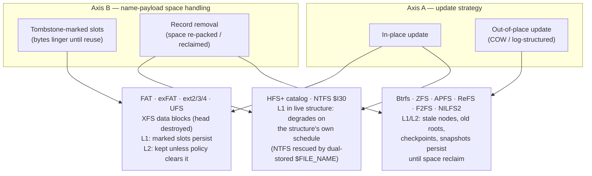

# SoK: What Survives Deletion? Filesystem Deletion Semantics and the Presentation of Deleted Artifacts by Forensic Tools

*Draft for internal adversarial review — not yet submitted anywhere. Revision 2 (post-critique): the two-axis model is presented as a descriptive organizing model, not a validated predictor; its predictive form is an explicit untested hypothesis whose validation protocol is committed in §7.*

## Abstract

Every filesystem answers the question "what happens when a file is deleted?" differently, and forensic practice has answered the follow-up — "how do we show the examiner what survived?" — in at least four incompatible ways. This paper systematizes both answers. First, we decompose deletion recoverability into three layers, each a separately answerable question with separately citable evidence: the **name** layer (is the filename recoverable, and how completely?), the **metadata-map** layer (is the record that maps the file to its content — run list, extent tree, block pointers — recoverable?), and the **content** layer (are the data blocks still unallocated and unoverwritten?). The decomposition re-poses Brian Carrier's file-name/metadata/content categories [1] as per-layer recoverability questions; the layers demonstrably do not fail in lockstep (ext3 destroys the map while name and content persist; HFS+ removes the name from its live tree fastest), which is what makes asking them separately useful — we claim no formal independence result. Second, we propose an **organizing model**: two design choices — **(A)** in-place versus out-of-place update (copy-on-write or log-structured), and **(B)** how the structure holding the *name payload* treats vacated space (tombstone-marked slots whose bytes linger, versus record removal with space reclaim/re-packing) — correlate with, and organize, the per-layer outcomes we survey. The model is descriptive: its predictive form is an untested hypothesis, and §7 commits a pre-registered filesystem×driver deletion-corpus protocol that would test it against two simpler baselines. We audit **seventeen on-disk formats and policy-divergent variants** (the counting unit is one master-matrix row: FAT12/16/32 as one lineage; ext2, ext3, ext4 as three, because their deletion *policies* diverge; plus exFAT, NTFS, ReFS, UFS/UFS2, XFS, HFS+, Btrfs, ZFS, APFS, F2FS, NILFS2, and the read-only boundary cases ISO 9660 and UDF), citing the published specification for each format's on-disk *layout* and implementation or community evidence for its deletion *policy* — the two are distinguished throughout, because specifications rarely prescribe what deletion leaves behind. Cases the model does not organize cleanly are called out as first-class findings (ext3's deliberate pointer zeroing; NTFS storing the same name in both a B-tree index record and a resident MFT attribute, so Axis B is not even a per-filesystem binary there; XFS keeping name payloads in directory data blocks while its B-trees index only hashes). Third, we taxonomize how forensic tools surface deleted artifacts — GUI overlay viewers, enumeration/extraction CLIs, carvers, and image mounters — on four structural axes: name recovered, content recovered, consumable by arbitrary software, and real name preserved. The taxonomy exposes a structural gap: tools that present artifacts to *arbitrary software* (mounters) have presented only the live namespace, because the two in-band channels a mount controls — the file name and its mode bits — are exactly the channels other programs depend on. We describe the 4n6mount design that targets this gap (out-of-band marking via xattrs and NTFS alternate data streams) strictly as an unimplemented requirements target, segregated from the empirical tool comparison. All recoverability statements are bounded by SSD TRIM, encryption and cryptographic erasure, driver-version divergence from specifications, and probabilistic overwrite timing.

---

## 1 Introduction

A forensic examiner who opens a disk image in FTK Imager [26] sees deleted files *in the directory tree*, at their real names, marked with a red-X icon. The tool can do this because it owns the pixels: the deletion marking is painted next to the name without touching it. A forensic *mount* — a tool that exposes the image as a real filesystem so that arbitrary software (AV scanners, hashing sweeps, `grep`, a hex editor, a licensed proprietary parser) can operate on the evidence — has no pixels. If it wants to present a recovered deleted file to that software, it has exactly three channels: the file's **name**, its **metadata** (mode bits, timestamps), and whatever **out-of-band** channel the host VFS offers (extended attributes on Linux/macOS [29], alternate data streams on NTFS). Decorating the name (`report.docx (deleted)`) breaks every consumer that opens files by name, corrupts hash-manifest matching, and is ambiguous with a live file that really is named `report.docx (deleted)`. Forcing the mode read-only breaks consumers that need to write. The only channel left is the out-of-band one.

That engineering corner — reached while designing the 4n6mount forensic mounter [30] — raises a question that is broader than any one tool: **across filesystems, what actually survives a deletion, and how have forensic tools chosen to surface what survives?** The per-filesystem facts are scattered across one canonical book [1], a dozen on-disk specifications, and twenty years of DFRWS papers; the tool-presentation question is usually not asked at all, because most tools control their own output surface and never face the mount's constraint.

This paper makes three contributions, stated at the strength the evidence supports:

1. **A three-question decomposition of deletion recoverability** (§2.1) — name, metadata-map, content — that re-poses Carrier's category model as per-layer recoverability questions and pairs each question with the class of on-disk evidence that answers it.
2. **A descriptive organizing model** (§2.2): update strategy (Axis A) and name-payload space handling (Axis B) organize the seventeen surveyed formats into three behavioral clusters, with the misfits documented as findings rather than smoothed over. The model's expectations are phrased as falsifiable hypotheses; §7 commits the experiment that would test them. Until that experiment runs, this paper claims a systematized evidence map, not a validated predictor.
3. **A taxonomy of tool presentation** (§4): four structural properties — recovers name, recovers content, consumable by arbitrary software, preserves the real name — classify the surveyed (shipped) tools and expose an empty cell: in-place presentation of deleted files, at their real names, to arbitrary software, with deletion status still signaled. §5 describes the 4n6mount design that targets that cell, as a requirements target explicitly separated from the empirical comparison because it is not yet implemented.

**Epistemic discipline.** Every empirical claim is tagged with its confirmation tier:

- **[S]** — documented in the cited on-disk *specification* or vendor reference. Specifications almost always cover *layout*; they rarely prescribe *deletion policy* (what the driver writes at unlink time). Where a claim is [S], it is a layout fact unless explicitly noted.
- **[C]** — established by *implementation or community evidence*: source code of the shipping driver, peer-reviewed forensic papers, Carrier [1], or maintained tool documentation. Most deletion-policy claims live here, and they are version-scoped: a driver two releases later may differ.
- **[I]** — our own *inference* from layout or from tool behavior. Inferences are hypotheses, not findings; each is phrased so the §7 protocol can refute it, and no [I] claim is condensed into a definite rating in the master matrix.

Recoverability language is hedged per claim, not by blanket disclaimer: an on-disk residue is *consistent with* recoverability; whether a given file is recoverable on a given volume depends on driver version, mount options (notably discard), workload, and elapsed time (§6).

---

## 2 An Organizing Model

### 2.1 Three recoverability questions

Carrier's category model [1, ch. 8] divides filesystem data into five categories: file system, content, metadata, file name, and application. Deletion recoverability lives in three of them. Our decomposition takes the category *identities* from Carrier and re-poses each as a *recoverability question* asked of a specific deletion on a specific volume:

| Layer | Question it answers | Carrier category | Typical evidence |
|---|---|---|---|
| **L1 — Name** | Is the filename (and its parent-directory linkage) recoverable, and how completely? | File name | Tombstoned directory entries, stale tree nodes, journal copies, dual-stored names |
| **L2 — Metadata-map** | Is the record mapping the file to its content — MFT run list, extent tree, block pointers, cluster chain — recoverable? | Metadata (the content-map portion) | Unlinked-but-intact inodes/MFT records, journal pre-images, stale COW tree nodes |
| **L3 — Content** | Are the data blocks still unallocated and not yet overwritten? | Content | Free-space residue; absence of TRIM |

**What this adds over Carrier, stated honestly.** Carrier's model (and TSK's `fls`/`icat` split, which operationalizes it) already separates these categories; the delta here is expository and analytical, not structural: (i) each category becomes a yes/how-completely question with a named evidence class, so that a per-filesystem audit produces three separately citable answers instead of one narrative; (ii) posing the questions separately surfaces the observation that motivates the whole systematization — **the layers do not fail in lockstep**. ext3 destroys L2 while L1 and L3 persist (§3.1.4); HFS+ removes L1 from its live tree fastest while L2/L3 residues persist in its journal window (§3.2.1); FAT destroys most of L2 (the chain) while L1 and L3 persist (§3.1.1). These are counterexamples to lockstep failure, which is the weaker — and demonstrated — form of the claim. We do **not** assert statistical independence or a multiplicative composition law; we have not formalized either, and nothing below depends on them. Scope note: "metadata" here is narrowed to the content *map*; attribute metadata (timestamps, ownership, security descriptors) travels with the same records in most designs but is a distinct recovery target that a complete logical recovery (the FTK-style presentation) additionally requires — we track it only incidentally.

### 2.2 Two descriptive axes

We observe that a filesystem's per-layer outcomes *correlate with* two design choices fixed at format-design time. We present them as an organizing model — they cluster the survey usefully and generate testable expectations — while stating plainly that their predictive power is an untested hypothesis (§7 defines the test, including the baselines an honest test must beat).

**Axis A — update strategy.**
- **In-place**: metadata structures are modified where they live (FAT, exFAT, NTFS, ext2/3/4, XFS, UFS, HFS+). Journaling variants copy metadata (and sometimes data) through a write-ahead journal before the in-place write — a bounded out-of-place residue bolted onto an in-place design.
- **Out-of-place**: no live structure is overwritten; every change writes new blocks and flips a root pointer (COW trees: Btrfs, ZFS, APFS, ReFS; log-structured: F2FS, NILFS2). Superseded structures linger as unreferenced-but-intact blocks until space reclaim.

**Axis B — name-payload space handling.** The critique of our own first draft applies here, so we state the axis carefully. What matters for L1 is not "is the directory a B-tree?" but two separable things:

- **B-payload**: where do the *name payload bytes* live, and what does deletion write over them? Two observed styles: **tombstone-marked slots** — the entry is marked free (a byte, a bit, a spanned record length, a freetag header) and the remaining payload bytes linger until slot reuse (FAT, exFAT, ext2/3/4, UFS, and — for the entry *head* only — XFS directory data blocks); versus **record removal** — the containing structure deletes the record and may re-pack or reclaim the space as part of normal operation (HFS+ catalog nodes, COW tree leaves).
- **B-index**: whether lookups go through a separate self-balancing index. The index can be over the payload records themselves (HFS+ catalog: the payload *is* the B-tree record) or over hashes/addresses with payloads stored elsewhere (XFS leaf/node directories index hashes; the names live in directory *data* blocks [10, dir2 structures]; ext4 HTree indexes hash buckets over classic dirent leaf blocks [8]).

Two surveyed formats show why the split is necessary, and they are findings, not footnotes: **NTFS** stores the same name payload *twice* — as a `$I30` index record (record-removal style) *and* resident in the MFT record's `$FILE_NAME` attribute (which deletion does not touch) [4] — so Axis B is not a per-filesystem binary for NTFS at all; the resilient copy, not the directory structure, governs L1. **XFS** is "tree-indexed" but its name payloads sit in data blocks whose freed regions receive a `freetag` header that destroys the entry head while potentially leaving trailing name bytes [10, §19 dir2 data-unused structure] — slot-like payload behavior under a tree index.

**Expectations (E1–E4) — hypotheses the survey is consistent with, to be tested by §7, not results:**

- **E1 (L1, tombstone payloads):** name bytes persist until slot reuse; completeness is limited by what the tombstone overwrites (FAT's first byte; the entry head under XFS's freetag; nothing, in observed driver behavior, under exFAT's InUse bit).
- **E2 (L1, record-removal payloads):** name recovery from the *live* structure degrades on the structure's own maintenance schedule — but on out-of-place designs the destruction is relocated, not avoided: stale nodes, old roots, checkpoints, and snapshots carry the pre-deletion records until reclaim.
- **E3 (L2):** in-place designs retain the metadata record (marked unused) with its map intact *unless the implementation deliberately clears it* — and that clearing is a policy choice neither axis captures (ext3 is the canonical case, §3.1.4). Out-of-place designs retain superseded metadata versions wholesale until reclaim; snapshots retain them indefinitely.
- **E4 (L3):** content-layer mechanics are near-universal — an allocator bit/entry is cleared and blocks idle until reallocation — so L3 differences are differences in *overwrite pressure*, not mechanism; and on SSDs, TRIM dominates every filesystem-level consideration (§6).

**What the model already fails to organize (found in this survey, before any experiment):** (i) *policy overrides* — ext3/ext4 zero the map at deletion although nothing in an in-place design requires it; UFS-family implementations make the same choice per-OS (§3.1.6); (ii) *dual storage* — NTFS, above; (iii) *bolt-on journals* — a journal gives an in-place design a bounded out-of-place residue window (HFS+, ext3/4); (iv) *contiguity shortcuts* — exFAT's `NoFatChain` leaves post-deletion L2 more complete than FAT's, an effect of an allocation optimization, not of either axis. These exceptions include mechanisms that decide real-world recovery outcomes; that is precisely why the model is offered as descriptive organization plus hypotheses, and why §7's protocol scores it against baselines rather than assuming it.

*Figure 1 — the two axes and the three behavioral clusters they organize in this survey. NTFS (dual-stored names) and XFS (slot-like payloads under a hash index) sit across cluster boundaries by design — the model's documented misfits, not exceptions to be explained away.*

---

## 3 Filesystem Systematization

Formats are grouped by cluster, not alphabetically. Each entry gives the deletion mechanism, per-layer outcome, and surviving on-disk evidence, with tier tags. Layout facts are cited to specifications; deletion-policy facts to implementations, papers, or tool documentation, version-scoped where known. The master matrix (§3.6) condenses the audit into categorical evidence statements — deliberately not ordinal scores.

### 3.1 In-place update, tombstone-marked name payloads

#### 3.1.1 FAT12/16/32

**Spec:** Microsoft, *FAT: General Overview of On-Disk Format* (fatgen103, v1.03) [2].

**Deletion mechanism.** The first byte of the 8.3 directory entry (`DIR_Name[0]`) set to `0xE5` is the spec-defined "entry is free" marker [S] [2]; the spec defines the marker and the free-cluster FAT value (0) but — like most specifications — does not prescribe what a driver must write at deletion time. Observed driver behavior: mainstream drivers set the `0xE5` tombstone on the short entry and the associated long-file-name (LFN) entries, and free the cluster chain by zeroing its FAT entries [C] [1, ch. 9–10].

**L1 — name: residue minus one byte per entry.** The 8.3 entry retains everything except its first character; LFN entries retain the long-name payload in their name fields (their first byte, the ordinal, is tombstoned), so the long name is typically reconstructable while the slots survive [C] [1, ch. 10]. Slots persist until directory growth reuses them [C].

**L2 — metadata-map: mostly destroyed.** The FAT chain — the only map — is zeroed by observed drivers; what remains in the entry is the start cluster (`DIR_FstClusLO`, and on FAT32 the high word `DIR_FstClusHI` — layout per spec [S] [2]) and the file size. Recovery therefore assumes contiguity from the start cluster [C] [1, ch. 9]. A claim our first draft carried — that some Windows versions zero `DIR_FstClusHI` at deletion — is **reported in secondary forensic material without named, tested OS versions; the FAT specification says nothing about it, and we have not verified a primary source or bench-tested it. We record it as unverified folklore, draw no conclusions from it, and exclude it from the matrix.** (If a page-pinned Carrier citation with named Windows versions is located, it can return as [C] with that scope.)

**L3 — content:** clusters idle until reuse; FAT has no bitmap — free means FAT entry 0 [S value; C persistence] [1, 2].

**Key evidence:** `0xE5`-tombstoned short + LFN entries; surviving start-cluster low word and size; orphaned data clusters.

#### 3.1.2 exFAT

**Spec:** Microsoft *exFAT file system specification*, §6.2.1 (EntryType), §6.3.4.2/§6.4.2.2 (`NoFatChain`), §7.1.5 (Allocation Bitmap) [3].

**Deletion mechanism — a cleared bit, not a tombstone byte.** exFAT has **no `0xE5` convention** — the sharpest practical difference from FAT and a common examiner confusion. Each entry's `EntryType` carries an `InUse` field in bit 7: `0x81–0xFF` are in-use, and the corresponding `0x01–0x7F` values are "unused-directory-entry" markers [S] [3, §6.2.1, §6.2.1.4]. Deletion as implemented by observed drivers clears bit 7 across the entry set (File `0x85 → 0x05`, Stream Extension `0xC0 → 0x40`, File Name `0xC1 → 0x41`) and clears the file's Allocation Bitmap bits [S for the encoding and bitmap semantics; C for the driver behavior] [3; Shullich's exFAT reverse-engineering report, cited by name in the references].

**L1 — name: the format permits full-name residue; the spec does not guarantee it.** The spec declares all fields of an unused entry "actually undefined" [S] [3, §6.2.1] — a conforming driver *may* wipe them. Observed drivers leave the bytes intact [C], in which case the File Name entries retain the complete UTF-16 name with no destroyed first character. Under that observed behavior, exFAT name residue is more complete than FAT's tombstone leaves — a driver-behavior comparison, not a spec guarantee, and version-scoped like every [C] claim here.

**L2 — metadata-map: often complete under observed behavior.** The Stream Extension entry retains `FirstCluster` and `DataLength` [layout S; retention C]. For a contiguous file (`NoFatChain = 1`) the FAT was never consulted — the extent is completely described by `FirstCluster + DataLength` [S] [3, §6.3.4.2] — so nothing map-critical was in the FAT to lose. For fragmented files (`NoFatChain = 0`) the FAT chain's fate at deletion is driver-dependent [I — untested here].

**L3 — content:** bitmap bits cleared; clusters idle until reuse [S mechanism] [3, §7.1.5].

**Model note (misfit iv):** the `NoFatChain` shortcut leaves post-deletion L2 more complete than FAT's — an allocation optimization's side effect, organized by neither axis.

**Key evidence:** entry sets with bit-7-cleared types (`0x05`/`0x40`/`0x41`); intact name payloads (driver-dependent); `FirstCluster + DataLength + NoFatChain` extents; cleared bitmap bits.

#### 3.1.3 NTFS

**Reference:** no public Microsoft on-disk specification; the community reference is the linux-ntfs documentation (Russon et al.) [4], corroborated by Carrier [1, ch. 11–13]. All NTFS deletion-behavior claims are [C] by construction.

**Deletion mechanism.** The MFT record is marked not-in-use: `Flags` at record offset 0x16 has bit `0x01` cleared [C] [4, *file_record*]. The record's **sequence number** (offset 0x10) is incremented at deletion time [C] [4: "The increment (skipping 0) is done when the file is deleted"], making stale `(record, sequence)` references detectably stale. Clusters are freed in `$Bitmap`; the record's bit in `$MFT`'s bitmap is cleared [C] [1, ch. 13]. The `$I30` index entry is removed from the directory's index structure [C] [1, ch. 11].

**L1 — name: dual-stored (the model's documented misfit).** (a) The `$I30` index record is record-removal-style and fragile under node re-packing, though remnants persist in index-node slack [C] [1, ch. 11]. (b) The `$FILE_NAME` attribute(s) inside the not-in-use MFT record persist untouched, carrying name, parent MFT reference, and four timestamps [C] [4, *attributes/file_name*]. Full paths are recomposable by chasing parent references. L1 is governed by (b), not by the directory structure.

**L2 — metadata-map: retained in the record.** The `$DATA` run list is not cleared at deletion [C] [1, ch. 11–13; 4, *attributes/data*]; recovery quality is gated by record reuse, not map destruction.

**L3 — content:** idle until reuse; resident `$DATA` keeps small-file content *inside* the MFT record, surviving as long as the record does [C] [4, *attributes/data*].

**Recovery aids:** `$LogFile` pre-images of MFT records and index blocks [C] [4, *files/logfile*]; `$UsnJrnl` `FILE_DELETE`-reason records carrying the file name [C] [4, *files/usnjrnl*].

**Key evidence:** not-in-use MFT records with intact `$FILE_NAME`/`$DATA`; incremented sequence numbers; `$I30` slack; `$LogFile`/`$UsnJrnl`.

#### 3.1.4 ext2 / ext3 (one layout, two policies)

**Layout:** ext4 kernel documentation covers the shared on-disk format [8]; deletion policies are implementation facts [C] [1, ch. 14–15; 21].

**Deletion mechanism (shared).** Unlinking removes the directory entry by **spanning**: the previous entry's `rec_len` is enlarged over the removed entry, whose name and inode-number bytes remain as directory slack [C] [1, ch. 14]. `i_links_count` drops to 0, `i_dtime` is set [C]; inode and block bitmaps are cleared.

**ext2 — map retained:** the 12 direct + 3 indirect pointers remain in the freed inode — the classic undelete scenario [C] [1, ch. 14].

**ext3 — map deliberately destroyed (model misfit i):** the inode's block pointers are zeroed at deletion — a crash-consistency policy, not a structural necessity [C] [21 — extundelete's documentation describes the behavior and builds its method on it]. The rescue is the journal: jbd2 retains pre-images of recently written metadata blocks, including pre-zeroing inode tables; `extundelete` [21] and `ext4magic` recover pointers from journal copies. The journal is circular — the window is bounded and short on a busy volume [C].

**L1:** spanned dirents preserve the name in slack until re-packing or slot reuse [C]. **L3:** blocks idle until reuse [C].

#### 3.1.5 ext4

**Layout:** [8]; forensic analysis by Fairbanks [9].

Directory handling as ext2/3 (spanning; names in slack) [C]. On deletion the extent-tree root in `i_block` is cleared, following ext3's policy in kind [C] [9; extundelete/ext4magic documentation]; `i_dtime` is set; the orphan list briefly links dying inodes [S structure; C forensic use] [8]. **L2 residue paths:** jbd2 pre-images of inode tables (the `ext4magic` method) [C]; interior extent-tree blocks of large files are freed, not wiped, and may persist as unallocated metadata blocks [I — untested; refutable by writing/deleting a many-extent file and scanning]. **L3:** idle until reuse; ext4-on-SSD is routinely mounted with discard or trimmed on schedule, which destroys L3 independent of the filesystem (§6).

#### 3.1.6 UFS / UFS2

**References:** FFS lineage documentation; Carrier [1, ch. 16–17]; McKusick & Ganger on soft updates [40].

**Deletion mechanism.** Directory entries span (`d_reclen` expansion), names persist in slack [C] [1, ch. 17]. Inode deallocation clears the link count and — in the FFS deallocation path described by the soft-updates literature — the block pointers, as part of the ordered-update discipline [C for the FFS policy as described in [40]; the exact residue is version-specific]. **We do not claim a per-OS matrix** (FreeBSD vs OpenBSD vs Solaris UFS behaviors): our first draft implied one from memory of Carrier ch. 16–17 without page pins, and we have not source-audited the three implementations. L2 is recorded as *implementation policy, per-version residue untested*. Soft updates does not journal block pre-images, so no ext3-style journal rescue exists; the UFS2 SU+J variant journals intent records, not pre-images [I — inferred from design descriptions; refutable by examining an SU+J journal after deletion].

**L1:** name residue in slack [C]. **L2:** pointer clearing is the documented FFS policy [C, 40]; per-OS/per-version outcomes untested here. **L3:** idle until reuse [C].

### 3.2 In-place update, record-removal name payloads

#### 3.2.1 HFS+

**Spec:** Apple TN1150 [15] — catalog file, B-tree node structure, extents overflow file, journal format. TN1150 specifies *layout*; it does not specify the deletion algorithm, byte-wiping, or node-merge policy — every claim about what deletion physically leaves is therefore [C] or [I], never [S].

**Deletion mechanism.** Names and file records are catalog B-tree records keyed by (parent CNID, name) [S] [15]. Deletion removes the file record and thread record from the catalog (logical fact, [C] — this is what the filesystem's semantics require and what forensic observation confirms). Within a node, records are packed contiguously with a reverse offset table [S] [15, "B-Trees"]. Whether record removal physically compacts the node immediately, what bytes remain in the node's free-space tail, and how merges propagate are **implementation behaviors TN1150 does not specify** — our first draft inferred compaction from the packed layout; we retain that only as [I], refutable by before/after catalog-node hexdumps, and the matrix records live-tree byte residue as *unknown (implementation-dependent)*, distinct from the record's logical removal.

**Why HFS+ is regarded as hostile to name recovery [C — community experience]:** the only copy of the name is a record in an actively maintained, in-place-rewritten tree — no tombstoned slot, no second copy in a metadata record (contrast NTFS `$FILE_NAME`). Once the containing node is rewritten for any reason, the live structure no longer carries the name; practical HFS+ recovery historically degraded to content carving [C].

**The measured rescue is the journal.** Journaled HFS+ (default since Mac OS X 10.3) writes copies of modified metadata blocks — whole catalog nodes included — through the journal [S journal format] [15, "HFS Plus Journal"]. Burghardt & Feldman demonstrated deleted-file recovery (names, CNIDs, extents) by parsing stale catalog nodes from the journal [C] [16]. The window is bounded by journal size (typically a few MB of metadata churn).

**L1/L2:** removed from the live tree at deletion [C]; byte-level residue in live nodes unknown [I]; journal window carries recoverable stale nodes [C] [16]. **L3:** allocation-file bits cleared; blocks idle until reuse [C].

#### 3.2.2 XFS

**Spec:** *XFS Algorithms & Data Structures* [10]. Layout is specified in detail; unlink-time residue is not.

**Name payloads (the Axis-B split in action).** XFS directories escalate through shortform / block / leaf / node forms [S] [10]. Name payloads live in directory *data* regions; the leaf/node B-trees index name hashes and addresses, not the payloads [S] [10]. Removing an entry converts its space into an `xfs_dir2_data_unused` region: a 2-byte `freetag` (`0xFFFF`) and length overwrite the head of the old entry (the leading bytes of the 64-bit inumber), and a trailing tag is written at the region's end [S — the unused-region format is specified] [10, dir2 data structures]. Bytes between header and trailing tag — which can include name bytes — are not specified to be wiped; whether they persist depends on coalescing with neighbors and reuse [I — untested; refutable by hexdumping a directory block after unlink, per directory form]. Shortform directories compact within the inode literal area [S form; I residue].

**Inode deallocation and L2.** `xfs_ifree`-path deallocation zeroes the mode and returns the inode to the free set (AGI/finobt); the AGI unlinked lists hold inodes between unlink and reclaim [S structures] [10]. **What remains in the data fork's literal area is not specified.** The `xfs_undelete` tool recovers files by reading residual extent records from freed inodes [C — tool behavior] [22], which is evidence that *on the kernel versions and layouts its author tested*, residue existed. We have not audited the current `xfs_ifree`/inactivation transaction path; current kernels may sanitize more than the tool assumes. The matrix records L2 as **unknown / version-tested only** — tool-anecdote evidence must not be condensed into a general partial-recoverability rating.

**Journal:** logical (operation-level), not block pre-images — no ext3-style rescue [C] [10]. **L3:** idle until reuse [C].

### 3.3 Out-of-place update: copy-on-write trees

Common structure first: deletion is a tree edit; every tree edit COWs the path from leaf to root; the superblock/checkpoint flips to the new root; the entire pre-deletion tree remains physically on disk — unreferenced — until its blocks are reclaimed. Recoverability shifts from "find the tombstone" to "find an old root, or a snapshot that still references the old tree." Persistence duration is governed by allocator pressure and is *unmeasured* in this paper for all four formats; snapshots convert it from probabilistic to definite.

#### 3.3.1 Btrfs

**Reference:** Btrfs on-disk format documentation [11].

Deletion removes `DIR_ITEM`/`DIR_INDEX`, `INODE_ITEM`, and `EXTENT_DATA` items from the subvolume's FS tree via COW node rewrites; the extent tree drops the extent's `EXTENT_ITEM`, whose back-references tied it to its owning tree [S structures] [11]. Pre-deletion node versions persist at their old locations until reallocation [C mechanism; timing unmeasured]; the superblock's generation numbers and backup-roots array let `btrfs-find-root`/`btrfs restore` walk older generations [C — btrfs-progs functionality]. Snapshots reference the old tree directly [S design]. **Key evidence:** stale nodes (valid header/checksum, older generation); backup roots; snapshots; back-references.

#### 3.3.2 ZFS

**References:** *ZFS On-Disk Specification* (2006 draft) [12]; Beebe et al. [13]; OpenZFS manuals [24].

Each transaction group COWs up to a new uberblock in a 128-slot ring per vdev label [S] [12, §1.3.4]; older uberblocks reference older MOS trees — pre-deletion states reachable in bulk *where their blocks have not been reclaimed* [C] [24: read-only/rewind import]. Deletion frees the dnode and updates space maps via COW; frees are deferred across TXGs [S mechanism] [12]. Snapshots pin referenced state; the ZIL may carry recent operation records [C] [13]. **Dedup nuance:** a freed block with a positive DDT refcount is not freed — content persists because another reference holds it [S design; C forensic reading] [12, 13]. **Key evidence:** uberblock ring; stale trees; snapshots; DDT-held blocks; ZIL.

#### 3.3.3 APFS

**References:** *Apple File System Reference* [17]; Hansen & Toolan [18].

COW with a per-transaction object map (`oid`→physical, keyed by `xid`); a ring of recent checkpoints persists in the checkpoint descriptor/data areas [S] [17]. File records (`j_inode_val`, `j_drec_val`, `j_file_extent_val`) live in per-volume B-trees; deletion drops them from the live tree via COW [S structures; C behavior] [17, 18]. Older checkpoints and stale nodes carry pre-deletion records until reclaim [C] [18]; snapshots — including Time Machine local snapshots, created routinely on macOS — pin the full pre-deletion tree and are the dominant practical recovery path on live Macs [C]. **Encryption caveat:** APFS volumes are commonly encrypted (FileVault; internal storage on modern Macs); L3 residue is ciphertext without keys, and per-file-key designs make key destruction cryptographic erasure (§6) [C]. **Key evidence:** checkpoint ring; stale omap/fs-tree nodes at older `xid`; local snapshots.

#### 3.3.4 ReFS

**References:** no public specification; Nordvik et al. [5]; Prade et al. (v3.4) [6]; ReFS journal analysis [7]. All claims [C], scoped to the ReFS versions those papers examined (1.x–3.4).

Metadata — directories and file tables included — lives in COW B+-trees (Minstore); pages are not updated in place, so superseded page versions persist with valid headers and identifiable table owners until reuse [C] [5, 6]. Deletion removes rows in new page versions; recovery scans for stale pages and reconstructs prior table states [C] [6]. A redo-style journal records operations on named objects [C] [7]. Integrity streams optionally checksum content without changing deletion semantics [C] [6]. **Key evidence:** stale Minstore pages; journal records.

### 3.4 Out-of-place update: log-structured

#### 3.4.1 F2FS

**References:** F2FS kernel documentation (layout) [14]; Lee et al., FAST '15 (design) [31]; kernel implementation `fs/f2fs/dir.c` [41].

Nodes (inodes, pointer blocks) and data are written out-of-place into 2 MB segments; the NAT indirects node locations; two checkpoint packs alternate, so the previous checkpoint — with its NAT/SIT state — remains on disk referencing a slightly older filesystem state [S] [14]. **Dentry deletion, correctly sourced:** F2FS dentry blocks carry a validity bitmap plus dentry and filename arrays [S layout] [14]; the kernel's `f2fs_delete_entry` clears the occupied bitmap bits and does **not** zero the dentry/name arrays [C — implementation source] [41]. This is implementation evidence for byte retention *in the block image being superseded* — but the cleared block is itself written out-of-place, and what a scanner can coherently recover depends on old-version reachability (NAT/checkpoint state), inline-dentry files (stored in the inode) versus regular dentry blocks, GC migration, and discard [I for end-to-end recoverability — unmeasured]. The matrix records L1 as *favorable residue mechanism, end-to-end recovery unmeasured* — not a definite rating. Old node and data versions persist in previously written segments until the cleaner reclaims them [S design; timing unmeasured]; fsync'd data has a roll-forward path [S] [14].

**L3:** log-structured writing avoids in-place overwrite, but F2FS deployments are flash deployments — discard/TRIM dominates (§6).

#### 3.4.2 NILFS2 (added coverage)

**References:** NILFS2 kernel documentation and project site [27].

NILFS2 is the out-of-place limiting case: log-structured with continuous checkpointing *as a user-facing feature* — checkpoints are created on every sync-class event, are listable (`lscp`) and mountable read-only, and can be promoted to snapshots [C — project documentation] [27]. A deleted file remains reachable through prior checkpoints **until the garbage collector reclaims those segments** — reachability is bounded by GC timing and the configured protection period, both tunable and workload-dependent [C mechanism; window unmeasured]. Deletion recoverability is here a documented product feature rather than a forensic accident — the strongest corroboration in this survey of E2/E3's direction (though corroboration is not validation; §7).

### 3.5 Boundary cases: ISO 9660 and UDF

**ISO 9660** (ECMA-119 [19]) is premastered and read-only: no deletion operation exists, so all three layers persist trivially — the degenerate fixed point of Axis A. In **multi-session** use, a later session's directory tree simply omits a file; the prior session remains physically present and parseable [C]. "Deletion" is pure supersession — structurally the COW pattern with sessions as generations.

**UDF** (ECMA-167 [20]) on write-once media applies the same idea per file: incremental writing appends new file entries (ICBs) and directory descriptors, and the Virtual Allocation Table remaps so the newest generation is live; prior generations of changed files persist by construction [S design] [20]. On rewritable media UDF behaves like a conventional in-place filesystem. The boundary cases anchor the model's Axis A: never-update and always-supersede are the extremes at which recoverability is maximal by construction.

### 3.6 Master matrix

Entries are **categorical evidence statements with tier and scope**, not ordinal scores — a deliberate change from this paper's first draft, whose ●/◐/○ symbols implied thresholds no corpus supports. "Until reuse/GC" persistence is mechanism-level [C]; durations are unmeasured. Every "driver/observed" entry is version-scoped per §3's text.

| Filesystem | Axis A | Name-payload handling at deletion | L1 name residue | L2 map residue | L3 content | Evidence |
|---|---|---|---|---|---|---|
| FAT12/16/32 | in-place | slot tombstone: first byte → `0xE5` | short name minus first byte + LFN payload persist until slot reuse [C] | chain zeroed by observed drivers; start-cluster low word + size remain in entry [C] | idle until reuse [C] | [1, 2] |
| exFAT | in-place | `InUse` bit cleared; unused-entry fields spec-**undefined** | full name observed intact under common drivers [C]; wiping is spec-permitted [S] | `FirstCluster`+`DataLength` persist [C]; complete extent when `NoFatChain`=1 [S layout] | idle until reuse [C] | [3] |
| NTFS | in-place | `$I30` record removed; `$FILE_NAME` untouched in MFT record | full name + parent ref in not-in-use record [C] | `$DATA` run list retained in record [C] | idle until reuse; resident data survives in-record [C] | [1, 4] |
| ReFS 1.x–3.4 | COW | table row dropped via new Minstore page versions | stale-page residue demonstrated [C] | stale-page residue demonstrated [C] | idle until reuse [C] | [5–7] |
| ext2 | in-place | dirent spanned (`rec_len`) | name persists in slack [C] | block pointers retained in inode [C] | idle until reuse [C] | [1] |
| ext3 | in-place | dirent spanned | name persists in slack [C] | pointers zeroed at delete [C]; jbd2 pre-image window [C] | idle until reuse [C] | [1, 21] |
| ext4 | in-place | dirent spanned | name persists in slack [C] | extent root cleared [C]; jbd2 window [C]; interior-node residue untested [I] | idle until reuse; discard common on SSD [C] | [8, 9] |
| UFS/UFS2 | in-place | dirent spanned (`d_reclen`) | name persists in slack [C] | pointer clearing is FFS policy [C, 40]; per-OS/version residue **untested** | idle until reuse [C] | [1, 40] |
| XFS | in-place | freed region gets `0xFFFF` freetag over entry head [S]; interior bytes unspecified | partial residue possible; **untested per directory form** [I] | **unknown / version-tested only** (tool evidence: xfs_undelete) [I/C] | idle until reuse [C] | [10, 22] |
| HFS+ | in-place (journaled) | catalog record removed from live B-tree | live-tree byte residue **unknown (implementation-dependent)** [I]; journal window carries stale nodes [C] | same: journal window [C]; live tree unknown [I] | idle until reuse [C] | [15, 16] |
| Btrfs | COW | items dropped via COW node rewrite | stale nodes/old roots until reclaim [C]; snapshots pin [S design] | same [C] | idle; no in-place overwrite [C] | [11] |
| ZFS | COW | dnode/dir entry dropped via COW | old TXGs via uberblock ring until reclaim [C]; snapshots pin [S design] | same [C]; dedup refcount may pin content [S/C] | idle until reuse [C] | [12, 13, 24] |
| APFS | COW | records dropped from fs-tree via COW | checkpoints/stale nodes until reclaim [C]; snapshots pin [C] | same [C] | idle; frequently ciphertext [C] | [17, 18] |
| F2FS | log-structured | dentry bitmap bit cleared; name/ino bytes not zeroed in that path [C, 41] | favorable residue mechanism; end-to-end recovery **unmeasured** [I] | old node versions + previous checkpoint pack [S layout]; recoverability unmeasured [I] | out-of-place; discard dominates on flash [C] | [14, 31, 41] |
| NILFS2 | log-structured | per-checkpoint trees | reachable via prior checkpoints until GC reclaim [C] | same [C] | until GC reclaim [C] | [27] |
| ISO 9660 | premastered | no deletion operation | prior sessions persist [C] | persist [C] | persist [C] | [19] |
| UDF (write-once) | append/supersede | new ICB generations; VAT remap | prior generations persist [S design] | persist [S design] | persist [S design] | [20] |

---

## 4 How Forensic Tools Surface Deleted Artifacts

The systematization above says what evidence *exists*; this section taxonomizes how shipped tools *present* it. The axes are structural properties: **Name** — does the presentation carry the recovered filename? **Content** — does it deliver recovered content bytes? **Arbitrary software** — can an unmodified third-party program consume the presentation directly? **Real name** — is the artifact reachable under its unmodified original name (byte-identical, so name-keyed tooling works)? **Deleted signal** — does the presentation carry the deleted status machine-readably? Two scope notes apply to every row: (i) all "content: yes" cells are conditional on L2/L3 survival per §3 — no tool recovers content the disk no longer holds; (ii) cells are sourced from vendor documentation and manuals at the access dates in the references; versioned behavioral testing of each tool cell is future work alongside §7.

### 4.1 Class T1 — GUI overlay viewers

FTK Imager [26], X-Ways Forensics [25], EnCase (cited by name; vendor page unavailable to automated verification), and Autopsy [23] present deleted entries inside the directory tree, at their real names, with a visual marker (FTK's red-X icon being canonical). Presentation is complete on L1/L2 and — where blocks survive — L3, but exists only inside a viewer the tool controls. The trade: the marking channel is pixels — free and unambiguous — and the cost is that no external program can consume the tree; everything round-trips through an export, where the deleted marking demotes to a report column.

### 4.2 Class T2 — enumeration and extraction CLIs

The Sleuth Kit's `fls -d` lists deleted entries (`*`-flagged), `icat` extracts content by metadata address, and `tsk_recover -e` bulk-exports recovered files to a separate output directory [32]. Names and content are recovered; output is consumable by arbitrary software — but in a **new namespace**: the artifact no longer sits at its real path among live siblings, parent context is flattened or re-encoded, and the deleted status lives in listing text, not on the artifact. `extundelete` [21], `ext4magic`, `xfs_undelete` [22], `ntfsundelete`, `fatcat` [33], and TestDisk are per-filesystem members of the same class: recover-to-elsewhere.

### 4.3 Class T3 — carvers

PhotoRec [34], foremost [35], and scalpel operate purely on L3: signature-scan unallocated (or all) space and emit content under synthetic names (`f0123456.jpg`). Metadata-agnostic by design — their power (they work when L1/L2 are gone, on any filesystem, even damaged volumes) and their defining loss: no names, paths, or timestamps; fragmentation defeats contiguous carving; output volume is enormous.

### 4.4 Class T4 — image mounters: the gap

Mounters split into two sub-layers, and neither surveyed layer surfaces deleted files in place:

- **Container-to-block**: `ewfmount` (libewf [36]), `xmount`, `affuse`, `qemu-nbd` — expose the image as a raw device; deletion presentation is out of scope for them by design.
- **Filesystem mounters**: `mount -o ro,loop`, libguestfs [37], imagemounter [38], Arsenal Image Mounter [39] — hand the block device to an ordinary filesystem driver, which presents the live namespace only: hiding unallocated structures is the driver's job. (Arsenal's Windows driver-level mounting enables native tooling against the volume; the namespace is still the driver's live tree.)

The result is an empty cell among the *surveyed* tools: none presents recovered-deleted files in place, at their real names, to arbitrary software, with deleted status machine-readably signaled. The cell is empty for an articulable reason: a mount's in-band channels — name and mode — are load-bearing for the consumers a mount exists to serve. Name decoration fails three ways (breaks open-by-name and extension-keyed tools; collides with legitimately named live files; silently converts a recovered name into a paraphrase). A GUI overlay is unavailable without pixels. What remains is the host VFS's out-of-band channel: xattrs [29] on FUSE platforms, alternate data streams on NTFS-backed Windows mounts. Additional axes a full evaluation of this cell would need — name-collision and orphan handling, marking visibility to non-opting readers, marking survival across copies, per-platform channel feasibility — are exactly the design dimensions ADR 0008 addresses (§5), and they become taxonomy columns once an implementation exists to test.

### 4.5 Taxonomy table — surveyed (shipped) tools only

| Class | Exemplars | Name | Content | Arbitrary software | Real name preserved | Deleted signal | Trade-off made |
|---|---|---|---|---|---|---|---|
| T1 GUI overlay | FTK Imager, X-Ways, EnCase, Autopsy | yes | yes¹ | no (viewer-locked) | yes (in-viewer) | pixels (in-viewer) | fidelity inside a walled garden |
| T2 recover-to-elsewhere | TSK `fls`/`icat`/`tsk_recover`, extundelete, xfs_undelete, fatcat | yes | yes¹ | yes (on exported copies) | no (new namespace/paths) | listing text only | consumability at the cost of context |
| T3 carvers | PhotoRec, foremost, scalpel | no | yes¹ | yes (on exported copies) | no (synthetic names) | implicit (everything is carved) | works without metadata; loses all of it |
| T4 mounters | `mount -o ro`, ewfmount, xmount, libguestfs, imagemounter, Arsenal | no (live tree only) | no (deleted absent) | yes | n/a (deleted not shown) | none | fidelity to the live tree; deleted evidence invisible |

¹ Conditional on L2/L3 survival per §3; identical conditional for every row.

### 4.6 Requirements target — not part of the empirical comparison

The following row describes an **unimplemented design** (4n6mount ADR 0008, status *Proposed* as of 2026-07-19 [30]). It is segregated here because it is a set of requirements, not an observed tool capability; every cell is *proposed and unvalidated*, and it must not be read against the shipped tools above until an implementation exists and is tested on the same terms.

| Design | Name | Content | Arbitrary software | Real name preserved | Deleted signal |
|---|---|---|---|---|---|
| 4n6mount in-place model (ADR 0008) | proposed/unvalidated | proposed/unvalidated¹ | proposed/unvalidated | proposed/unvalidated | proposed/unvalidated (out-of-band xattr/ADS) |

¹ Same L2/L3-survival conditional as every tool row — plus the design's own stated limitations (§5): marking is invisible to non-opting readers and is stripped by channel-unaware copies.

---

## 5 4n6mount's Position (facts and design commitments, not grades)

4n6mount [30] is a FUSE/Dokan-based forensic mounter over the forensic-vfs abstraction; the shipped release mounts disk images (ext4, NTFS, exFAT, HFS+, APFS, ISO 9660 readers), forensic containers (EWF, VMDK, AFF4, AD1), archives, and memory dumps, presenting `ro/` (read-only evidence), `rw/` (copy-on-write overlay), plus `deleted/`, `journal/`, `metadata/`, and `unallocated/` surfaces [30, README]. The shipped `deleted/` surface is a T2-style flat namespace (`{inode}_{name}`).

Its v2 design (ADR 0008 [30]; status **Proposed — accepted for review, not implemented**) specifies the requirements target of §4.6:

- **Placement.** A recovered entry whose parent is known and whose real name is free renders in-place in the tree at its real path under its real name; name-collision deletes and true orphans collect under `$Orphans/` (the `$` following the NTFS/TSK metadata-name convention), disambiguated as `<name>@<filename-safe-UTC-mtime>~<record-id>`.
- **Marking.** Deleted status conveyed only out-of-band: `user.4n6.status = deleted | orphan` plus recovered MACB timestamps under `user.4n6.macb.*` as xattrs on macOS/Linux; NTFS alternate data streams (`<name>:4n6.status`, `<name>:4n6.macb`) under Dokan on Windows. No name decoration; no forced read-only (writes copy-up onto the overlay). The ADR states the FTK equivalence: same model as the red-X tree view; the channel — attributes instead of pixels — is the translation forced by the consumer being arbitrary software.
- **Per-layer honesty.** The render rules consume §3 directly: NTFS/exFAT entries render in-place where the surviving name is complete; FAT renders with a reconstructed-placeholder first character plus a `user.4n6.name-incomplete` flag; ext3/ext4 entries are placeable but reads may fail loud; COW filesystems without snapshots frequently yield an honest empty.
- **Fail-loud gate.** Marked entries appear only when the reader produces real recovered entries; enumeration failure surfaces as an I/O error, never an empty directory; a per-file recovery failure is a read error, never a 0-byte success.
- **Stated limitations.** The marking is invisible to consumers that do not read the attribute channel — a recursive copy or hash sweep ingests recovered content indistinguishably from live content unless it opts in (the deliberate trade of serving arbitrary software first). The marking survives only channel-aware copies: ADS is stripped by copies to non-NTFS targets; `cp` without xattr preservation drops `user.4n6.*`.

These are design commitments checkable against the repository. Whether the model, once implemented, outperforms T1/T2 presentations on real corpora is an open empirical question this paper does not answer; §4.6 keeps the design out of the shipped-tool comparison for exactly that reason.

---

## 6 Threats to Validity and Boundary Conditions

**Overwrite timing is probabilistic.** Every persistence statement in §3 describes residue *at the moment after deletion*. Survival until acquisition depends on allocator behavior, write pressure, and elapsed time — none examiner-controlled. Recoverability statements are "consistent with recovery," never guarantees.

**TRIM/discard destroys L3 below every filesystem.** On SSDs, TRIM of freed LBAs lets the device return zeros (or arbitrary data) for those ranges regardless of what the filesystem left; queued/online discard makes this near-immediate. The forensic impact was established early in the SSD era [28]. Every L3 statement in §3 is conditioned on the absence of effective TRIM.

**Wear-leveling and the FTL.** Flash translation layers relocate and duplicate data invisibly; the LBA space is a fiction over NAND. Chip-off/FTL-aware acquisition can surface more residue than the LBA view — or less. The matrix describes the LBA view only.

**Encryption changes the layer that matters.** Full-disk encryption (BitLocker, LUKS, FileVault) makes L3 residue ciphertext. Per-file-key designs (APFS on iOS; fscrypt) enable cryptographic erasure: destroying the key is equivalent to overwriting the content even though ciphertext blocks persist.

**Spec vs. implementation — the paper's central caveat, applied per claim.** Most load-bearing deletion behaviors in §3 are driver policies, not spec mandates (exFAT field non-wiping, ext3 pointer zeroing, FFS pointer clearing, XFS inode residue, F2FS non-zeroing). A different driver — or the same driver two kernel versions later — may behave differently. [C] claims are version-scoped; [I] claims are hypotheses. Re-verify against the specific implementation in evidence before any statement reaches a report.

**Anti-forensics.** Secure-delete tools overwrite content and metadata before unlinking; journal scrubbing, forced TRIM, and snapshot deletion target exactly the residues §3 enumerates. A map of what survives default deletion is also a map of what an informed adversary destroys.

**The organizing model is itself untested.** The two axes are a synthesis consistent with the specifications and literature cited — nothing more. Their predictive form is the hypothesis §7 exists to test; until then, per-filesystem evidence in §3 stands on its own citations, not on the model.

---

## 7 Future Work: Pre-Registered Validation Protocol (committed, not yet run)

The experiment that would upgrade §2.2 from descriptive organization to a validated predictor — or refute it — is specified here so it can be pre-registered and executed as a follow-on. It is Tier-1 by the standard this project applies elsewhere: real filesystems, real drivers, real deletions, measured residue.

**Corpus construction.** For each cell of (filesystem family × implementation version × configuration): scripted `mkfs` with recorded defaults; populate a fixed manifest of files spanning the residue-relevant classes — resident/inline vs. non-resident, single-extent vs. deliberately fragmented, short vs. long names (8.3-only, LFN, >255-byte-safe Unicode), shallow vs. deep paths, plus per-FS special cases (NTFS resident `$DATA`; F2FS inline dentries; exFAT `NoFatChain` on/off; HFS+ >8-extent forks) — `sync`; snapshot the image (T0); delete scripted subsets; snapshot again (T1); apply a controlled churn workload and snapshot at T2. Configurations vary the §6 dominators explicitly: discard on/off; journaled/non-journaled where the format offers both; snapshots present/absent on COW formats. Implementation versions are pinned and recorded (kernel release, driver module, mkfs tool version, OS build for NTFS/APFS/ReFS).

**Measurement (per deleted file, per layer, at T1 and T2).**
- *L1*: locate name residue by structure-aware scan (tombstoned slots, stale nodes, journal) and record `name-bytes-recovered ∈ {full, partial(k/n bytes), none}` plus the evidence source (slot / stale node / journal / snapshot).
- *L2*: attempt map reconstruction from residue only; record `map-recovered ∈ {sufficient-to-extract, partial, none}`, judged by whether extraction proceeds without content-signature guessing.
- *L3*: extract via recovered or ground-truth map; record `content-recovered ∈ {hash-match, partial, none}` against the manifest's per-file hashes.

**Denominators.** Every rate is reported per (format-version, configuration, file-class, layer, time-point) cell with its n; no cross-cell aggregation without stratification. Cells the corpus cannot populate (e.g., ReFS without a Windows Server harness) are reported as not-run, never imputed.

**Prediction-accuracy metric and baselines.** Before any run, each of three models states one expected outcome class per (format-version, layer, file-class) cell: (a) the two-axis model of §2.2; (b) an Axis-A-only baseline (in-place vs. out-of-place, nothing else); (c) a Carrier-category baseline (the category exists in the format ⇒ residue expected — the no-model default). Accuracy = fraction of measured cells where the stated expectation matches the measured outcome class; report per-layer and overall, with exact binomial confidence intervals. **The two-axis model is claimed as a validated predictor only if it beats both baselines with non-overlapping intervals; otherwise §2.2 remains, permanently and by design, a descriptive organization.** The pre-registered expectations also discharge the matrix's `[I]` cells: each `unknown/untested` entry in §3.6 names the measurement that resolves it (XFS inode residue per kernel; HFS+ node byte residue per macOS version; F2FS end-to-end name recovery; UFS per-OS pointer residue; exFAT fragmented-file FAT-chain fate).

**Out of scope for the protocol's first iteration:** FTL-level effects (requires hardware instrumentation), encrypted-volume arms (adds a key-management dimension), and the tool-presentation cells of §4.5 (a separate versioned-tool bench).

### 7.1 Initial results (partial — macOS filesystems run, Linux pending)

A first iteration of this protocol has been executed and pre-registered; the harness, the three models' committed predictions, and the measured data live under [`experiment/`](experiment/) ([`experiment/RESULTS.md`](experiment/RESULTS.md)). Only the four filesystems that `mkfs` natively on the macOS host were run — **FAT32, exFAT, HFS+, APFS** — as real filesystems in raw disk images, deleted, churned, and snapshotted at T0/T1/T2, with residue measured by The Sleuth Kit 4.12.1 as an independent oracle (L1 name, L2 map) plus a filesystem-agnostic content-marker byte-scan (L3). The Linux families (ext4, XFS, Btrfs, F2FS) require a Linux runner and are deferred with the identical protocol documented in `experiment/RESULTS.md`; they were not synthesized.

On the **66 measured cells** at T1 (immediate post-delete), the two-axis model scored **52/66 = 78.8% [67.0, 87.9]** (Clopper-Pearson exact 95% CI) and both baselines tied at **49/66 = 74.2% [62.0, 84.2]**. The two-axis model is directionally higher — its edge concentrated in L2 (fragmented-file map loss) and L1 (the FAT 8.3 tombstone), the Axis-B and update-strategy effects the baselines are blind to — but its interval **overlaps** both baselines'. By this section's own criterion, that is **not** a validated-predictor result: on this small, macOS-only corpus **§2.2 stands as descriptive organization.** The corpus does corroborate the survey's descriptive core directly — the layers were observed failing out of lockstep (FAT fragmented file: name full, map partial, content intact; HFS+: name and map gone from the live tree, content intact). The Axis-A-only and Carrier baselines produced identical predictions on these four formats and diverge only on cells this iteration does not contain (post-reclaim out-of-place volumes, snapshot-pinned residue) — so the Linux and COW-with-snapshot arms are where the models are expected to separate, or the two-axis model to be refuted. The count is reported as tested (four formats, 66 cells); nothing is extrapolated to the unrun families.

---

## 8 Related Work

**Foundations.** Carrier's *File System Forensic Analysis* [1] is the canonical treatment of FAT, NTFS, ExtX, and UFS deletion behavior and the origin of the category model §2.1 re-poses; The Sleuth Kit [32] operationalizes it, and its `fls`/`icat` separation of name-layer and metadata-layer addressing is the direct ancestor of our L1/L2 split. Farmer & Venema's *Forensic Discovery* (cited by name in the references) established free-space persistence as an empirical, measurable question — the stance §7 adopts.

**Metadata-based undelete, per matrix family.** ext: Fairbanks' ext4 analysis [9] documents the structures; `extundelete` [21] documents ext3's pointer zeroing and the jbd2 pre-image method; `ext4magic` extends it to ext4. NTFS: the linux-ntfs reference [4] underpins `ntfsundelete` and every MFT-record-based recoverer; `$UsnJrnl`/`$LogFile` recovery is standard practice built on the same documentation. FAT/exFAT: `fatcat` [33] implements FAT-entry-based browsing/undeletion; Shullich's SANS report reverse-engineered exFAT before Microsoft published the specification [3]. XFS: `xfs_undelete` [22] is, to our knowledge, the only maintained implementation-level evidence for post-`xfs_ifree` inode residue. HFS+: Burghardt & Feldman's journal-based recovery [16] remains the definitive name-layer result for a record-removal filesystem. APFS: Hansen & Toolan's independent decoding [18] preceded Apple's reference [17] and established checkpoint/snapshot-based recovery. ReFS: Nordvik et al. [5], Prade et al. [6], and the journaling analysis [7] together constitute the public knowledge base. ZFS: Beebe et al. [13] identified the uberblock-history and ZIL artifacts this paper's §3.3.2 summarizes. F2FS: Lee et al. [31] document the design; recovery work is thinner here than for any other family in the matrix — a literature gap, not an evidence-of-absence.

**Carving — a distinct literature, deliberately separated.** Carving (PhotoRec [34], foremost [35], scalpel; Garfinkel's fragment-aware carving work and the associated public corpora, cited by name) answers only L3 and is evaluated by content-hash yield, not name/path fidelity. Keeping it a separate taxonomy class (T3) rather than a lesser undelete is a deliberate framing choice: its metrics, datasets, and failure modes (fragmentation, format validation) are disjoint from metadata-based recovery, and conflating the two literatures is a recurring source of overclaimed "recovery rates."

**Journal/log-based recovery as a cross-cutting technique.** The same move — read the bounded out-of-place residue a consistency mechanism leaves — recurs independently per family: jbd2 pre-images (extundelete/ext4magic [21]), the HFS+ journal [16], NTFS `$LogFile`/`$UsnJrnl` [4], ReFS's redo journal [7], and, at the limit, NILFS2's checkpoints-as-a-feature [27]. To our knowledge no prior work names this as one technique class across filesystems; §2.2's "bolt-on journals" misfit is a step toward that.

**Presentation.** We are not aware of prior work that taxonomizes *how* tools surface deleted artifacts; the closest artifacts are the tools' own manuals ([26], [25], [23], [32]), which state presentation choices without comparing them. §4's cells are sourced from those documents at the access dates recorded in the references; versioned behavioral verification of each cell is future bench work.

**Coverage note (in lieu of a claimed systematic search).** Sources were selected by a fixed rule — for each matrix family: the primary layout specification, plus at least one peer-reviewed or implementation-level deletion/recovery source where one exists — not by a documented keyword-protocol literature search. Families where the rule found no peer-reviewed recovery work (exFAT beyond Shullich, F2FS, NILFS2, UDF) are stated as such above; a systematic search protocol is future work alongside §7.

---

## 9 Conclusion

Deletion recoverability decomposes into three separately answerable questions — name, metadata-map, content — and the seventeen formats surveyed here cluster legibly under two design axes: how updates happen, and what happens to the bytes of a vacated name slot. The clusters are real and useful: tombstoned slots leave names; record-removal structures shed them on their own maintenance schedule; out-of-place designs relocate destruction into stale generations that snapshots make permanent; and the read-only boundary cases sit at the extreme where recoverability is maximal by construction. The misfits are equally real and more instructive: map zeroing is a policy no axis captures; NTFS's dual-stored names make Axis B a per-structure rather than per-filesystem property; a bolt-on journal is a bounded time machine; a contiguity flag can leave deletion *less* destructive in a successor format than in its ancestor. We have deliberately stopped short of the claim our first draft made: the axes *organize* this survey, and whether they *predict* — better than cruder baselines — is exactly what the pre-registered protocol of §7 will measure. On the presentation side, four shipped tool classes have made four different trades among name, content, consumability, and context; the presentation that would serve arbitrary software in place, at real names, with deletion still signaled, requires the one channel no GUI ever needed — the out-of-band attribute — and remains, as of this draft, a requirements target awaiting implementation and the same empirical scrutiny.

---

## References

See [references.md](references.md) for the full reference list with per-entry access notes and the citation audit appendix. Inline citation keys: [1] Carrier FSFA 2005 · [2] Microsoft fatgen103 · [3] Microsoft exFAT spec · [4] linux-ntfs docs · [5] Nordvik et al. 2019 · [6] Prade et al. 2020 · [7] ReFS journaling, DFRWS-APAC 2021 · [8] ext4 kernel docs · [9] Fairbanks 2012 · [10] XFS Algorithms & Data Structures · [11] Btrfs on-disk format · [12] ZFS On-Disk Specification · [13] Beebe et al. 2009 · [14] F2FS kernel docs · [15] Apple TN1150 · [16] Burghardt & Feldman 2008 · [17] Apple File System Reference · [18] Hansen & Toolan 2017 · [19] ECMA-119 · [20] ECMA-167 · [21] extundelete · [22] xfs_undelete · [23] Autopsy · [24] OpenZFS zpool-import(8) · [25] X-Ways Forensics · [26] FTK Imager · [27] NILFS2 · [28] Bell & Boddington 2010 · [29] xattr(7) · [30] 4n6mount · [31] Lee et al. FAST '15 · [32] TSK man pages · [33] fatcat · [34] PhotoRec · [35] foremost · [36] libewf · [37] libguestfs · [38] imagemounter · [39] Arsenal Image Mounter · [40] McKusick & Ganger, Soft Updates · [41] Linux kernel, fs/f2fs/dir.c.
